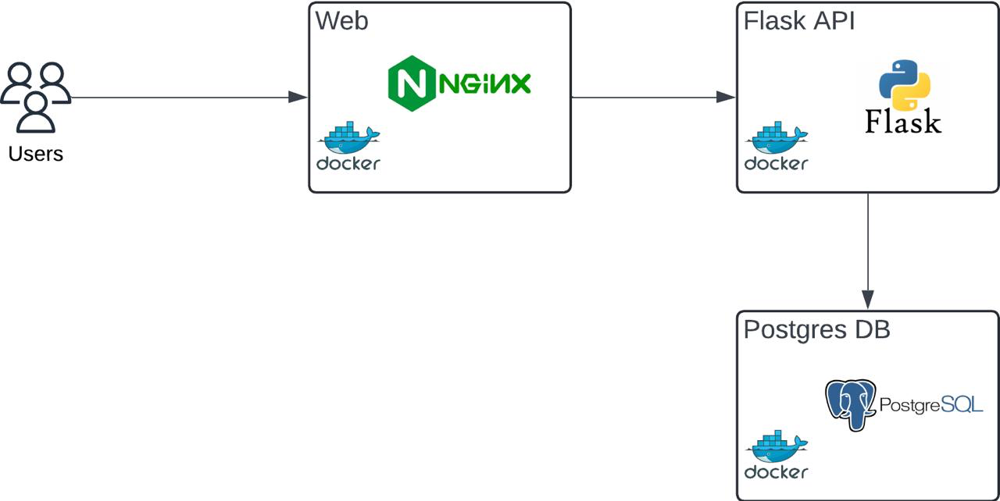

# Coffee Run
<div align="center">
  
</div>


A simple web application for tracking shared expenses among groups with automatic balance calculations, ensuring fair cost distribution and eliminating the awkward *"Who pays?"* moment!

So, whose buying me coffee today? ☕️

<div align="center">
  
</div>

## Features

- 👥 **User Management** - Create user profiles
- 🏘️ **Group Management** - Organize expenses by groups
- 💰 **Expense Tracking** - Record shared expenses with itemized breakdowns
- ⚖️ **Auto Balances** - Fine Grained "who owes whom" calculations
- 🔄 **Next Payer** - Smart suggestion for who should pay next
- 📊 **Transaction History** - Full audit trail of all expenses

## Top Level Design
<div align="center">
  
</div>

## Tech Stack

**Frontend:**
- React.js (18.2.0)
- React Router
- React Toastify
- Tailwind CSS

**Backend:**
- Python Flask (3.10)
- Flask-CORS
- psycopg2 (PostgreSQL adapter)

**Database:**
- PostgreSQL (Version 17)

## Installation

### Prerequisites
- Docker: Version `20.10` or higher.
- Docker Compose: Version `1.29` or higher.
- Git: For cloning the repository.
- Ports `3000` (frontend), `5001` (backend) and `5400` (database) must be available.

### Directory Structure
````
CoffeeRun/
├── backend/
│   ├── main.py               # Flask application
│   ├── requirements.txt      # Python dependencies
│   ├── scripts               # Scripts for initialization
│   │   ├── init.sql          # Database initialization script  
├── frontend/
│   ├── public/
│   ├── src/
│   │   ├── components/       # React components
│   │   ├── pages/            # Page components
│   │   ├── App.js            # Main application
│   ├── package.json          # Frontend dependencies
````
### How to run the application ⚙️
1. Clone the repo:
   ```bash
   git clone https://github.com/nabiharaza/CoffeeRun.git
   cd CoffeeRun/
   ```
2. Create your own database with the script in `backend/scripts/init.sql` 
   - **Imp Note: Change the `utils/db.py` to match your database credentials**


3. Build and Run with Docker Compose 🐳
   ```bash
    docker-compose up --build
   ```
   - Frontend: `http://localhost:3000`
   - Backend API: `http://localhost:5001`
   - Database: `localhost:5400` (exposed for debugging).
   

4. Stop the application
   ```bash
   docker-compose down
   ```
   - To remove volumes: `docker-compose down -v`
   
### Development
- Backend: Edit files in `backend/`, then rebuild with docker-compose up --build.
- Frontend: Modify files in `frontend/`.
- Database: Connect to `localhost:5400` with credentials `postgres:postgres`.]

### Assumptions
- Debts are only paid via paying for others coffee expense.

### Limitations and Caveats 🌵
- User authentication and authorization is not implemented.
- Users cannot be added/removed once the group is created.
- Searching capability is not available for groups
- Error handling is limited.
